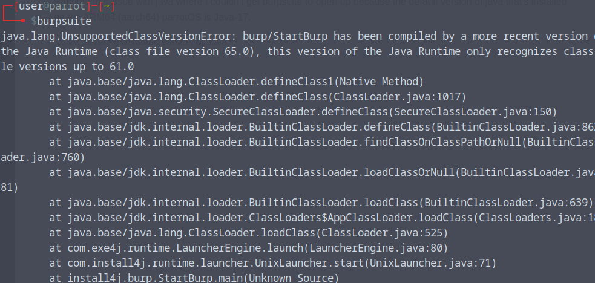
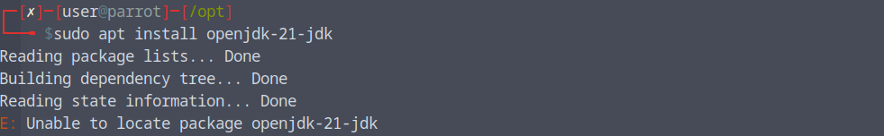
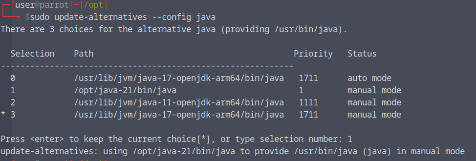
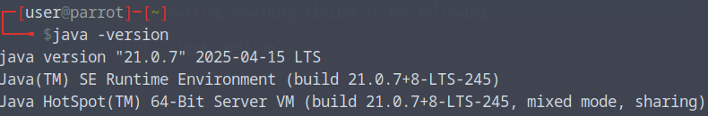
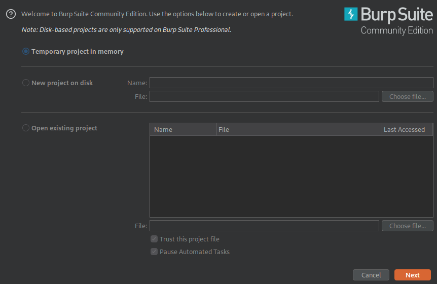

<h1>Java Fun</h1>

- Ran into this issue with java where I couldn't get burpsuite to open up because the default version of java that's installed on the ARM64 (aarch64) parrotOS is Java-17. 
> That's a severely outdated version of Java just saying...

 </img> 

- To fix this you think you'd just run sudo apt upgrade or update but apparently ParrotOS is configured to thing Java17 is the money, I assume it has something more to do with OpenJDK. But sudo apt install openjdk doesn't fix the issue either.

 </img> 

- The way I was able to fix the error is by installing Java21 through a wget pull and dropping it into the `/opt` directory
> If you're new to the world of linux the /opt directory stands for "optional" and is where you place any third-party software that isn't managed by your system package manager (apt, yum, pacman, etc.).

- So change your directory to `/opt` and run the following:

`wget https://download.oracle.com/java/21/latest/jdk-21_linux-aarch64_bin.tar.gz`

`sudo mv jdk-21.0.7/ /java-21`

`sudo update-alternatives --config java`

 </img> 

- The commands we're running above installs the jdk-21 package directly into the /opt directory I then decided to move the directory into a nice name of `java-21`
- The command `sudo update-alternatives --config java` let's us change our system's default java package to `Java-21` which is what I did by using the selection number `1`.

- Then just verify your version of java `java -version` to make sure it's out putting something similar to the following: 

 </img> 

- Tada, your burpsuite will now launch as it's supposed to:

 </img> 

