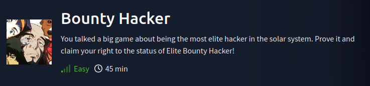

# :dollar: TryHackMe: Bounty Hacker

**Author:** B0bTheSkull  
**Room URL:** [TryHackMe - Bounty Hacker](https://tryhackme.com/room/cowboyhacker)  
**Date Completed:** 04-20-2025  
**Category:** Machine Exploitation 
**Difficulty:** Easy  
**Tags:** Privilege Escalation, FTP, Brute-Force Attacks, Hydra

---

## Approach & Mindset :bulb:
> *“This room gives a very brief description, going into the room my mindset was set with as much reconnisance I could initially as I don't know the room's content (e.g. it's not labeled web hacking etc.).”*

---

## Tools Used :hammer:

- [ ] NMAP
- [ ] LinPEAS
- [ ] GTFObins
- [ ] Privilege Exploitation Knowledge

---
### Living up to the Title
**Question:** `Who wrote the task list?`
- First step of this room and almost any room is some recon... our only given is an IP Address so let's run a nmap scan on it and discover any open ports.
- 

- This nmap scan yielded us a wealth of information. One piece of information that caught my eye immediately out of the gate: `ftp-anon: Anonymous FTP login allowed`. This is a very good piece of information, it means we can access a server anonymously that people download and upload files onto for some reason. Connecting to the server yields the following:

- Next step through utilizing the `get` command the FTP utilizes we can pull locks.txt and task.txt onto our machine to answer some of of the questions as to what's the users' password and who wrote the task list.
- If you view the contents from the task.txt file after downloading it to your local machine, you'll find the answer to the first question.

    
Answer:
 lin

---

**Question:** `What is the users password?`

**Question:** `user.txt`

- After viewing the contents in the `locks.txt` file we're presented with a list of what appears to be passwords.

- Using the `locks.txt` file that holds a bunch of passwords we can attempt a very calculated bruteforce to ssh into lin's account.

- Within the home directory of lin's account is the `user.txt` document, which yields the flag for the question.

    
Answer:
 RedDr4gonSynd1cat3

    
Answer:
 THM{CR1M3_SyNd1C4T3}

---

**Question:** `root.txt` 

- One of the first commands I like running when getting access to a linux machine is `sudo -l`. However, it's important to note this is a really noisy command, lots of antivirus and SOC applications will catch this program and alert there's a potential breach on the system.
- However, for the sake of this being a practice machine and me having no need to worry about my footprint we're going to run `sudo -l` to see any files or directories that we have root priveleges to.

---

---

- Immediately I decided to start researching what this is and if there's anyway I can exploit this binary to my advantage. I came across this amazing website [GTFObins](https://gtfobins.github.io/) which has compiled tutorials and edits to binaries that may exist on Linux machines to gain root privileges. 

- Boom we've gained root privileges. From there you just need to locate the `root.txt` document and read the contents for the final flag.

    
Answer:
 THM{80UN7Y_h4cK3r}

