# :cherry_blossom: TryHackMe: Sakura — OSINT Room Writeup

**Author:** B0bTheSkull  
**Room URL:** [TryHackMe - Sakura](https://tryhackme.com/room/sakura)  
**Date Completed:** 04-07-2025  
**Category:** OSINT  
**Difficulty:** Easy  
**Tags:** OSINT, Social Media, Image Analysis, Google-Fu :wink:
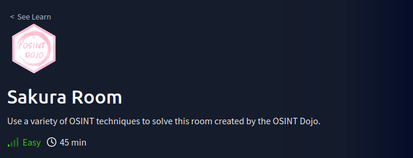
---

## 1. Approach & Mindset :bulb:

> Brief summary of the room’s theme.    
> *“This room drops you into a hands-on digital manhunt, testing a wide range of OSINT techniques. Built for beginners but grounded in real-world tactics, you’ll follow a staged investigation to track down a cybercriminal—one clue at a time. Each challenge gives you just enough pretext to start digging, and it’s your job to connect the dots using social media sleuthing, image forensics, and pure recon grit. Think of it as a virtual stakeout with zero paperwork.”*

---

## 2. Tools Used :hammer:

- [ ] Google (dorking, image search)
- [ ] EXIF Viewer (e.g., `exiftool`, https://www.metadata2go.com/)
- [ ] Social Media Scrapers (e.g., WhatsMyName, Sherlock)
- [ ] Reverse Image Search (Google, Yandex, TinEye)
- [ ] GeoGuessr Skills™️ (a.k.a. map detective work)
- [ ] WHOIS / DNS tools
- [ ] Common sense & digital intuition, aka your Pre-Frontal Cortex

---
### TIP-OFF
**Question:** _What username does the attacker go by?_  
**Answer:** `FindItLikeEveryoneElse`

**How I found it:**
- The room provides you with the following clue: 
<p align="center"></p>

- At first glance this doesn't look to bee too helpful, there's some binary going on behind a large **You've Been Pwned!** sign.
- However, with most image clues I always like to inspect the metadata through the use of exiftool. It yeilded the following:
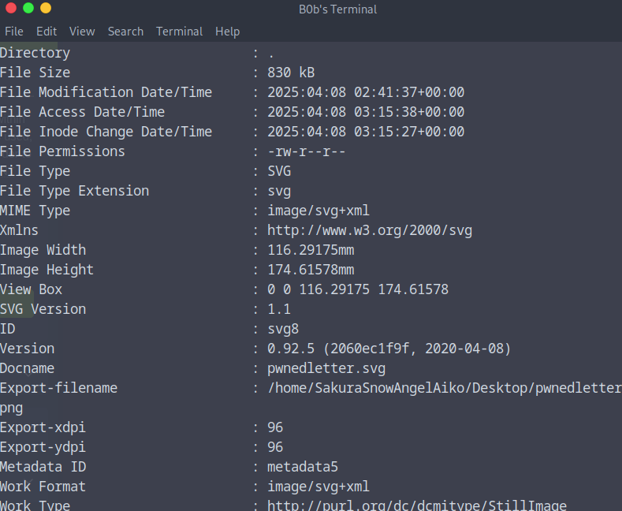
---

### RECONNISANCE
**Question 1:** _What is the full email address used by the attacker?_
**Answer:** `SakuraSnowAngel83@protonmail.com`

**Question 2:** _What is the attacker's full real name?_
**Answer:**`Aiko Abe`

**Methods** <br>

- To find the email address of the attacker I decided to do more investigating on their github which yielded their public PGP key:
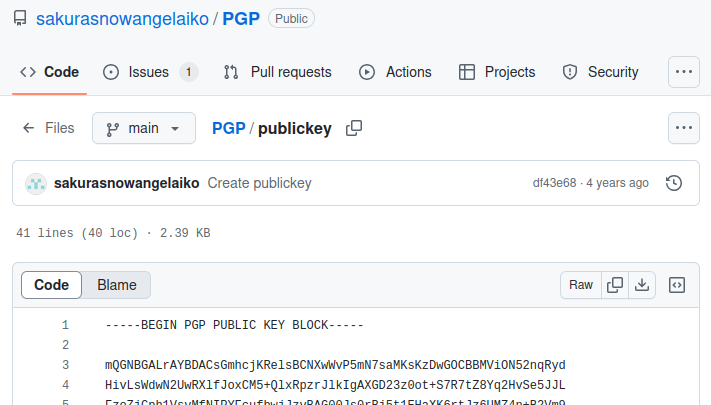
- A PGP key is a pair of cryptographic keys—one public, one private—used to encrypt, decrypt, and digitally sign data, allowing secure communication and identity verification.
- I decided to base 64 decode the PGP key into ASCII text based on some information I found in regard to PGP keys on reddit. That process yielded the following:
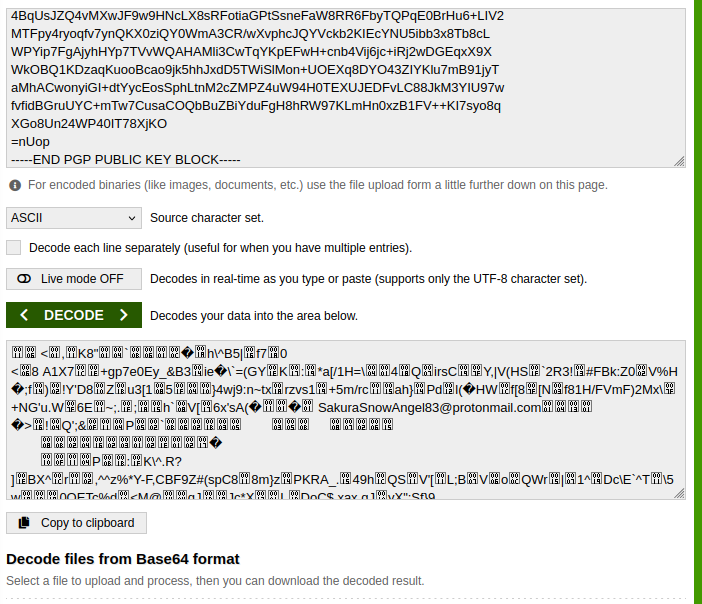
---
- As for finding the name of our attacker I found nothing useful in regards to a name based off of the information from their github.
- However, we have two usernames linked to our attacker already `sakurasnowangelaiko` and `SakuraSnowAngel83`. Therefore, I decided to employ some google-dorking techniques after other failed tactics.
  > I ran into some issues using the python tool Sherlock which is used to check social media sites for usernames
- The following results appeared upon googling just the username of the individual:
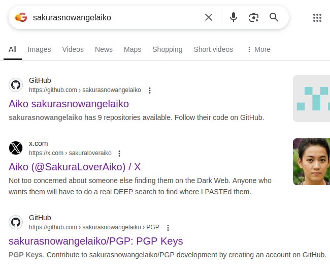
- After clicking into the @SakuraLoverAiko x account (twitter for real ones) I found a post that provided the answer we were looking for:
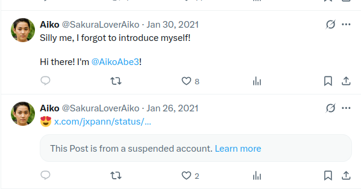
---
### UNVEIL
**Question:** _What cryptocurrency does the attacker own a cryptocurrency wallet for?_
**Answer:** `Ethereum`

**Question:** _What is the attacker's cryptocurrency wallet address?_
**Answer:** `0xa102397dbeeBeFD8cD2F73A89122fCdB53abB6ef`

**Question:** _What mining pool did the attacker receive payments from on January 23, 2021 UTC?_
**Answer:** `Ethermine`

**Question:** _What other cryptocurrency did the attacker exchange with using their cryptocurrency wallet?_
**Answer:** `Tether`

**Methods:**
- First step taken was trying to find out the cryptowallet of our attacker, I decided to start by exploring one of the several github repos revolving around crypto.

<p align="left">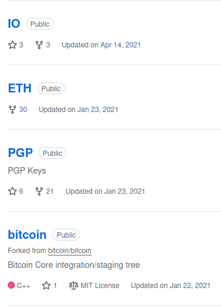</p>

- After lots of clicking through repos and looking for anything that could relate to a bitcoin wallet I found a custom writen 'mining script' that the attacker had created.
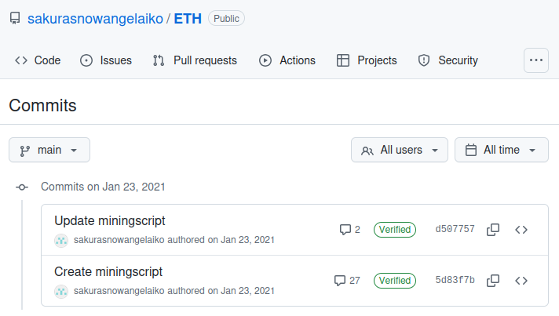
- Looking through some of the commits on the repo yielded our answer:
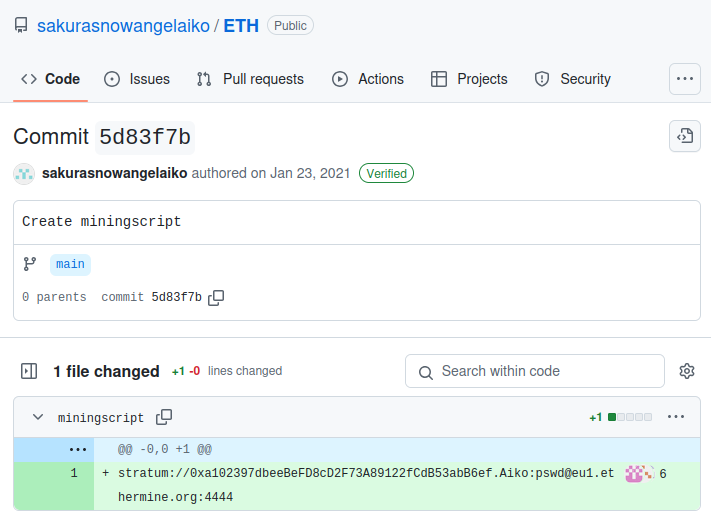
- Decided to google the wallet to figure out some more details on it:
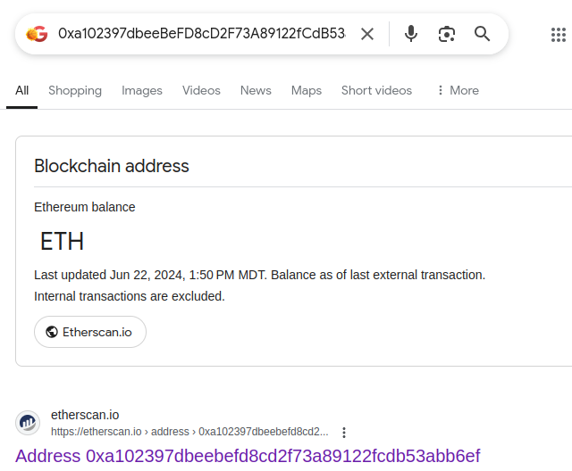
- Going into the Etherscan.io we're greeted with logs on all the transfers of the wallet.
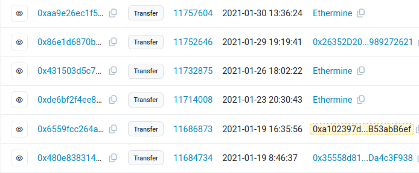
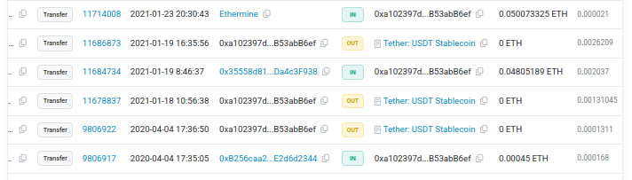
- Through the use of the logs we're able to answer all the questions.
---
### TAUNT
**Question:** _What is the attacker's current Twitter handle?_
**Answer:** `SakuraLoverAiko`

**Question:** _What is the BSSID for the attacker's Home WiFi?_
**Answer:** `84:af:ec:34:fc:f8`

**Methods:**
- First we start with doing our best to find anything that deals with network and WiFi identifications in relation to our attacker. IP addresses, MAC addresses, possibly any screenshots they've posted that tell us the BSSID (if only that'd be too easy) etc.
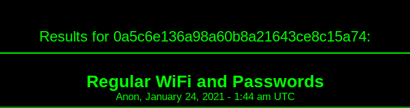
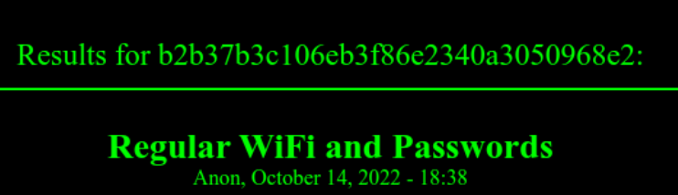
> A fun little side note, I hate having to type letters and numbers from images so I wrote a quick little python script that pulls everything from those images above it's here if you wanna use it: [Script](scripts/TextExtract.py)
- And they posted this on their twitter which literally says 'Wifi and Passwords' in the same sentence. Liquid gold for any ethical hacker or non ethical hacker.
- My initial thought was this was a large version of a MAC-address because the caption detailed: "Posting this so I don't forget my APs when I get a new phone"
- Furthermore, they mentioned this in the comments:
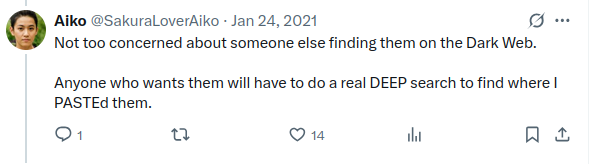
- After finding this key piece of information I realized this is probably a known MD5 hash that they used to post information into a pastebin DeepPasteV3 is what I found with a similar UI to the screenshots provided.
- Upon findthing the paste you're given the following information:
```
Saving here so I do not forget

School WiFi Computer Lab: 			GTRI-Device		GTgfettt4422!@
Mcdonalds: 					Buffalo-G-19D0-1        Macdonalds2020
School WiFi: 					GTvisitor		GTFree123
City Free WiFi: 				HIROSAKI_Free_Wi-Fi 	H_Free934!
Home WiFi: 					DK1F-G			Fsdf324T@@
```
- Next step is to use the information such as the ``HomeWiFi: DK1F-G Fsdf324T@@`` to find out the BSSID of the attacker's HomeWifi. We're given an SSID and Password it appear but we're still in need of the BSSID. 
- Thanks to incredible efforts from the community and developers over at [Wigle](https://wigle.net) a simple search query by the SSID yeilds our answer.
---
### HOMEBOUND
**Question:** _What airport is closest to the location the attacker shared a photo from prior to getting on their flight?_
**Answer:** `DCA`

**Question:** _What airport did the attacker have their last layover in?_
**Answer:** `HND`

**Question:** _What lake can be seen in the map shared by the attacker as they were on their final flight home?_
**Answer:** `Lake Inawashiro`

**Question:** _What city does the attacker likely consider "home"?_
**Answer:** `Hirosaki`

- The three photos we're given via X or Twitter that you'll need to use to answer the questions are as followed:
  <div align="center">
  <p>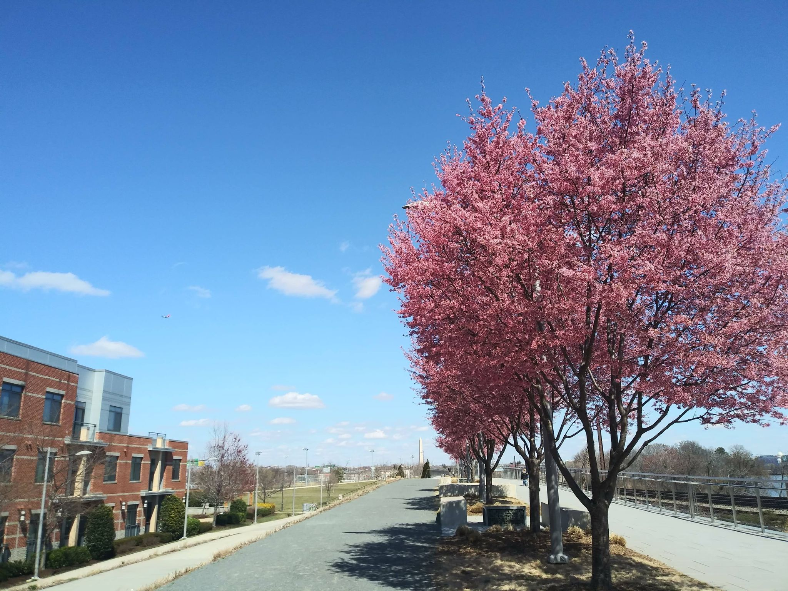<p>

  <p></p>

  <p></p>

  </div>
---
- Reverse google image searching for this entire task was my friend, there are some good other alternatives when it comes to reverse image searching however I found most of my success to come from Google. 
- If searching by the whole image doesn't yield any of the information you're looking for I highly recomend changing the parameters to focus on certain parts of the image, e.g. buildings, certain landscape features. Any other identifiers that could potentially help you find what you're looking for is worth a shot.
### Congrats that's the end of the room
If you'd like to support my caffeine addiciton: <a href="https://ko-fi.com/b0btheskull">Donate Here</a>
